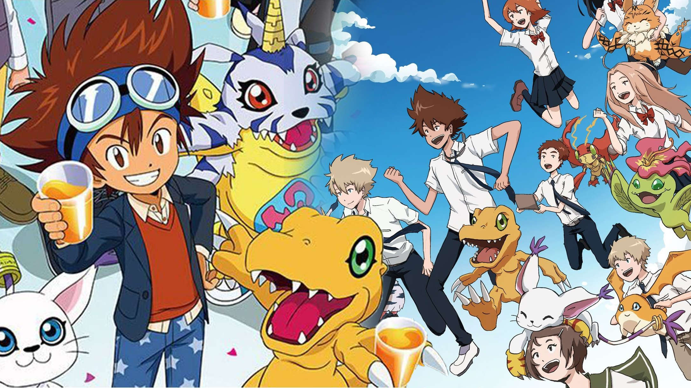

# Digimon: Lab 1 Reflection  



## Question:
Describe your process in finding these answers. Include details such as who you worked with, what methods you tried, what worked or didn’t work, what could have gone better, and what you learned during this lab. Feel free to attach images, screenshots, pseudocode, etc to elaborate on your response!


## Process:
I worked with Darson Chen, Bulyn Panjamapirom, Tuhin Ghosh, and Mr. Lee. 

#### Question 1:
For the first problem, where we're asked to find the average speed of all digimon, it was very useful to refere to our previous penguin lab to figure this problem out. My process was first making two variables, `digimon_speed` and `digi_speed_counter` and for each digimion, we added their speed value to `digimon_speed` and we added 1 to `digi_speed_counter`. Once the iterations are complete, `digi_speed_counter` gave us the total number of digimon that had a speed (so all of the digimon), and `digimon_speed` gave us the total of all of the speeds added together. To find the average, we simply did `digimon_speed`/`digi_speed_counter`, and ended up with 120.4 as our answer. 

```python
Question 1:
for Digimon in data:
    digimon_speed += int(Digimon["Spd"])
    digi_speed_counter += 1 

averageSpeed = (digimon_speed/digi_speed_counter) 

print("The average speed of all Digimon is " + str(round(averageSpeed, 2)))
```
#### Question 2:
For the second question, we were asked to write a function that could count the number of Digimon with a specific attribute. Initially, I had difficulty with this problem because we had always defined specific attributes. For example, we said that
`HP = Digimon["HP"]` and so on, and I was struggling with how to make both of the attributes and the results for those general. But, my peers helped me realize that it was very simple in that we just had to make both of them variables.

```python
Question 2:
def count_digimon(Attribute, value): 
    counter = 0 
    for Digimon in data:
            DigimonAttribute = Digimon[Attribute] 
            if DigimonAttribute == value: 
                counter += 1 
```
Here, we defined two variables `Attribute` and `value`. Attribute could be HP, Spd, Memory, and so on, and the value would be a different result such as 590, 78, or 4. Then, we made a counter and defined another variable `DigimonAttribute` to be any attribute **for each digimon**. Then, we said that if the attribute was a certain value, add 1 to a counter. In the end, the counter would return all of the digimon that had an attribute with a certain value, and thus our function is complete.

#### Question 3:
For the third and final question, we were asked to make a team of 3 pokemon whose memories added  to be ≤ 15, and whose attack stats added to be ≥ 300. For this one, I had diffuculy figuring out how to iterate through all of the digimon to find a team of 3 that satisfied the requirements. I first thought of making groups of 3 with a pattern that, using 4 digimon, would be 123, 124, 134, 234, and then repeated using the next digimon. To elaborate, I was thinking of trying to do 4C3 for the first 3 and the next 1, and repeating that throughout. However, that would be a lot of work, and with the aid of my peers and some more thinking, I figured out that it would be much easier to iterate through all of the digimon for each of the three spots in the group.
```python
squad_group = []

for digimon1 in data:
    memory1 = int(digimon1["Memory"])
    attack1 = int(digimon1["Atk"]) 
    for digimon2 in data:
        memory2 = int(digimon2["Memory"])
        attack2 = int(digimon2["Atk"])
        for digimon3 in data: 
            memory3 = int(digimon3["Memory"])
            attack3 = int(digimon3["Atk"])
            if digimon1 != digimon2 != digimon3: 
                if memory1 + memory2 + memory3 <= 15:
                    if attack1 + attack2 + attack3 >= 300:
                        squad_group = [digimon1["Digimon"], digimon2["Digimon"], digimon3["Digimon"]]

print("The group of " + str(squad_group) + " is the elite group that satisfies our requirements.")
```

I had 3 for loops in total, and nested them, so that once we iterated through all the digimon for one slot in the group of 3, we would do the same for the other 2 slots. I defined the attack and memory stats for each digimonm then put parameters that they couldn't all be the same digimon, that the sum of their memory stats had to be ≤ 15, and that their attack stats had to be ≥ 300. If there was a group of 3 digimon that satisfied these requirements, then we put them in a group and returned that group. Doing that, I got that the group of `Flamedramon, Wormmon, Tsumemon` satisfied our requirements.


Specifically, I learned how to utilize nested for loops for efficient iteration through multiple variables. In this lab I also did a lot with converting values to ints and strings, and I feel like I became a lot better in knowing when to convert variables to different types. Overall, the lab was  fun and I enjoyed it a lot! :D
